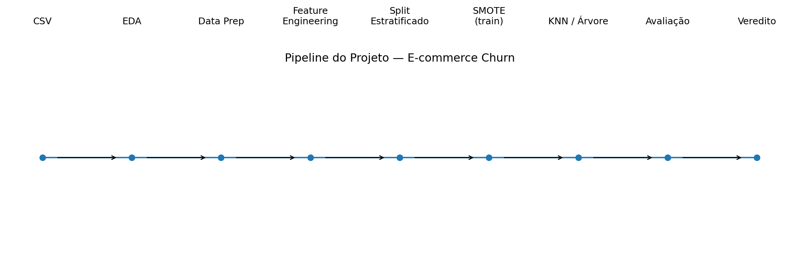

# Projeto Machine Learning — E-commerce Churn

## 1. Descrição do projeto

Este projeto implementa um pipeline de Machine Learning para prever **churn de clientes em um aplicativo de e-commerce**. O objetivo de negócio é identificar clientes com maior probabilidade de abandonar a plataforma para possibilitar ações preventivas de retenção, como ofertas ou cupons.

A base utilizada é **`E Commerce Dataset - E Comm.csv`**.

## 2. Objetivo de negócio

O problema é uma classificação binária:

- `Churn = 0`: cliente não abandonou a plataforma.
- `Churn = 1`: cliente abandonou a plataforma.

Em uma campanha de retenção, dois erros são relevantes:

- **Falso Positivo (FP):** o cliente recebe uma ação de retenção mesmo não estando em churn.
- **Falso Negativo (FN):** o cliente estava em churn, mas o modelo não o identificou.

Neste projeto, o FN recebe atenção especial porque representa uma oportunidade de retenção perdida.

## 3. Arquitetura do projeto



## 4. Fases implementadas

### Fase 1 — EDA

Foram analisados:

- dimensões da base;
- tipos de dados;
- valores ausentes;
- estatísticas descritivas;
- distribuição da variável `Churn`;
- distribuições de variáveis numéricas;
- correlação de Pearson;
- presença de valores discrepantes.

A base final possui **5,630 registros e 20 colunas**, com taxa de churn de **16.84%**.

### Fase 2 — Data Prep

- duplicidades foram verificadas;
- valores nulos numéricos foram tratados com **mediana**;
- valores nulos categóricos foram tratados com a categoria mais frequente;
- outliers foram identificados pelo IQR;
- os extremos foram tratados por clipping usando limites calculados somente no conjunto de treino;
- `CustomerID` foi removido das variáveis preditoras por ser um identificador.

### Fase 3 — Feature Engineering

Foi criada obrigatoriamente a variável:

`cashback_por_pedido = CashbackAmount / OrderCount`

O cálculo foi protegido contra divisão por zero e valores infinitos.

### Fase 4 — Separação, Balanceamento e Escalonamento

O dataset foi dividido em:

- **80% treino**
- **20% teste**
- `stratify=y`

O SMOTE foi aplicado **somente ao treino**, evitando data leakage.

Para o KNN, foi aplicado `StandardScaler` às variáveis numéricas. Para a Árvore de Decisão, o escalonamento foi dispensado.

### Fase 5 — Modelagem

#### KNN

Foram testados:

- K = 3
- K = 5
- K = 7
- K = 9

Melhor configuração pelo F1 de teste: **K = 3**.

#### Árvore de Decisão

Foram testados:

- `max_depth = 3`
- `max_depth = 5`
- `max_depth = 7`
- `max_depth = None`

Melhor configuração pelo F1 de teste: **max_depth = None**.

## 5. Resultados

### KNN — melhor configuração

| Métrica          | Resultado |
| ---------------- | --------: |
| Accuracy         |    0.8934 |
| Precision        |    0.6182 |
| Recall           |    0.9632 |
| F1-score         |    0.7531 |
| Falsos positivos |       113 |
| Falsos negativos |         7 |

### Árvore — melhor configuração

| Métrica          | Resultado |
| ---------------- | --------: |
| Accuracy         |    0.9529 |
| Precision        |    0.8586 |
| Recall           |    0.8632 |
| F1-score         |    0.8609 |
| Falsos positivos |        27 |
| Falsos negativos |        26 |

## 6. Diagnóstico de overfitting

O diagnóstico foi realizado comparando métricas de treino e teste para diferentes níveis de complexidade.

A análise considera F1-score, recall, precisão e o gap entre treino e teste para avaliar a capacidade de generalização.

## 7. Veredito de negócio

**Modelo indicado no cenário de retenção: KNN (K=3)**

O KNN identificou mais clientes em churn (recall=0.963) e produziu menos falsos negativos (7) do que a Árvore (26). Isso reduz o número de clientes em risco que passariam sem uma ação preventiva, embora aumente os falsos positivos (113) e, consequentemente, o volume potencial de cupons.

O resultado deve ser interpretado dentro do contexto operacional da empresa: reduzir FN pode aumentar FP, elevando o número de clientes que recebem incentivos sem necessidade. Portanto, a política de custo real de cupons e valor esperado de retenção deve ser monitorada após a implantação.

## 8. Dicionário de dados

| Variável                      | Tipo      | Papel         | Nulos na base original |
| ----------------------------- | --------- | ------------- | ---------------------: |
| `CustomerID`                  | `int64`   | Identificador |                      0 |
| `Churn`                       | `int64`   | Alvo          |                      0 |
| `Tenure`                      | `float64` | Preditor      |                    264 |
| `PreferredLoginDevice`        | `object`  | Preditor      |                      0 |
| `CityTier`                    | `int64`   | Preditor      |                      0 |
| `WarehouseToHome`             | `float64` | Preditor      |                    251 |
| `PreferredPaymentMode`        | `object`  | Preditor      |                      0 |
| `Gender`                      | `object`  | Preditor      |                      0 |
| `HourSpendOnApp`              | `float64` | Preditor      |                    255 |
| `NumberOfDeviceRegistered`    | `int64`   | Preditor      |                      0 |
| `PreferedOrderCat`            | `object`  | Preditor      |                      0 |
| `SatisfactionScore`           | `int64`   | Preditor      |                      0 |
| `MaritalStatus`               | `object`  | Preditor      |                      0 |
| `NumberOfAddress`             | `int64`   | Preditor      |                      0 |
| `Complain`                    | `int64`   | Preditor      |                      0 |
| `OrderAmountHikeFromlastYear` | `float64` | Preditor      |                    265 |
| `CouponUsed`                  | `float64` | Preditor      |                    256 |
| `OrderCount`                  | `float64` | Preditor      |                    258 |
| `DaySinceLastOrder`           | `float64` | Preditor      |                    307 |
| `CashbackAmount`              | `int64`   | Preditor      |                      0 |

**Variável criada no projeto:** `cashback_por_pedido` — razão entre `CashbackAmount` e `OrderCount`.

## 9. Como baixar e executar

### Google Colab

1. Abra o arquivo `.ipynb` no Google Colab.
2. Execute as células em ordem.
3. Na célula de carregamento, envie `E Commerce Dataset - E Comm.csv`.
4. Aguarde a execução das seis fases.
5. Ao final, a última célula gerará:
   - `README.md`
   - `pipeline_projeto.png`
6. Baixe esses arquivos pelo painel de arquivos do Colab.

### Execução local

O notebook foi desenvolvido para Google Colab. Para execução local, instale as dependências:

```bash
pip install pandas numpy matplotlib scikit-learn imbalanced-learn jupyter
```

Depois abra o notebook com Jupyter, VS Code ou Google Colab.

## 10. Estrutura sugerida do GitHub

```text
projeto-machine-learning/
├── data/E Commerce Dataset - E Comm.csv
├── notebook/Projeto_Machine_Learning_Ecommerce_Churn.ipynb
├── README.md
└── imagens/pipeline_projeto.png
```

## 11. Boas práticas de versionamento

O projeto foi desenvolvido em branches por fase:

- `fase/eda`
- `fase/data-prep`
- `fase/feature-engineering`
- `fase/balanceamento`
- `fase/modelagem`
- `fase/avaliacao`

Commits semânticos:

```text
feat: adiciona análise exploratória
feat: implementa imputação de valores nulos
feat: cria cashback_por_pedido
feat: adiciona balanceamento com SMOTE
feat: implementa testes de KNN
feat: implementa testes da árvore de decisão
feat: adiciona matrizes de confusão
docs: adiciona README do projeto
```

## 12. Conclusão

O projeto demonstra um fluxo completo de Ciência de Dados aplicado a um problema de negócio real: preparação dos dados, engenharia de atributos, prevenção de data leakage, balanceamento, escalonamento específico por algoritmo, comparação de hiperparâmetros, diagnóstico de overfitting e análise dos erros.

A conclusão final não deve ser baseada apenas em acurácia. Para churn, é fundamental compreender o impacto de falsos positivos e falsos negativos e alinhar a escolha do modelo à estratégia financeira e operacional da empresa.
